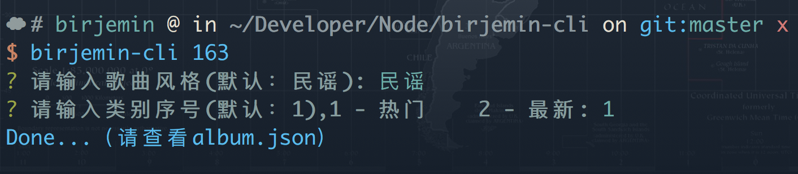

# Node脚本练习

### 安装步骤
1. git clone
2. npm install
3. npm link

### 使用

#### 爬取网易云音乐的歌单（35条）
1. 安装模块

```
npm install cheerio
npm install  superagent
npm install inquirer
```

2. 命令

```
birjemin-cli 163 
```

3. 参数

需要输入的派别(下图):


需要输入的类别：
最新，最热

4. eg



#### 合成图片

##### 方法1（纯js）
1. 安装模块

```
npm install jimp
```

2. 命令

```
birjemin-cli cover
```

3. 备注：不支持更改颜色，不支持中文（需要额外的fnt文件）

##### 方法2（借助imagemagick、graphicsmagick）
1. 安装

```
brew install imagemagick
brew install graphicsmagick
brew install ghostscript
```

2. 命令

```
birjemin-cli cover2
```

3. 结果


4. Q/A

Q: Command failed: gm convert: Unable to read font (/usr/local/share/ghostscript/fonts/n019003l.pfb)

A: http://www.80iter.com/blog/1512370342239557

#### 文件备注

1. 安装模块

```
npm install sqlite3
npm install colors
```

2. 命令
```
birjemin-cli add <dir> <desc>
birjemin-cli alter <dir> <desc>
birjemin-cli del <dir>
birjemin-cli list
```

3. 作用
感觉没啥作用。。。略鸡肋

### 参考

1. [https://github.com/BooheeFE/Eitri](https://github.com/BooheeFE/Eitri)
2. [https://github.com/tj/commander.js](https://github.com/tj/commander.js)
3. [https://juejin.im/entry/5aa2c21df265da23a334d40f](https://juejin.im/entry/5aa2c21df265da23a334d40f)